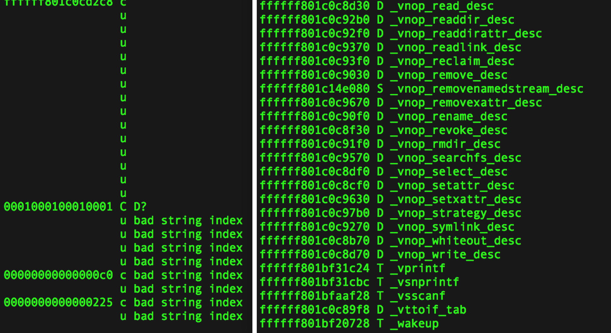
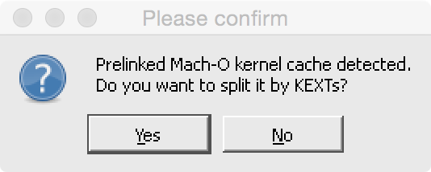

# iosdumpkernelfix
This tool will help to fix the Mach-O header of iOS kernel which dump from the memory. So that IDA or function symbol-related tools can loaded function symbols of ios kernel correctly

[](https://twitter.com/cocoahuke) [](https://travis-ci.org/cocoahuke/iosdumpkernelfix) [](https://github.com/cocoahuke/iosdumpkernelfix/blob/master/LICENSE) [](https://www.paypal.com/cgi-bin/webscr?cmd=_s-xclick&hosted_button_id=EQDXSYW8Z23UY)

For ARM 32/64 bit iOS kernel, this tool  will correct fileoff of segment and section, retrieve the location of the symbol table

Although the function symbols in the iOS kernel have been removed a lot, but the IOKit interface function name is still there, and relatively complete

IOKit function symbols are used to create connection between Kexts that are loaded from the userland and IOKit interface in the kernel (KPI), The embedded kernel extension in iOS does not need this, though.

Tested in iOS8&iOS9 kernel cache, support 32/64 bit iOS kernel

# How to use

**Download**
```bash
git clone https://github.com/cocoahuke/iosdumpkernelfix.git \
&& cd iosdumpkernelfix
```

**Compile and install** to /usr/local/bin/
```
make
make install
```
**Usage**
```
Usage: iosdumpkernelfix <orig kernel path> <output path after fixed>
```
Specifies path of input file and output file, and output the corrected file

# Demo
I left a sample iOS8.3 kernelcache in the test directory

Sample output:
```
...
Get correctly value after cacl: 0xffffff801c153000-0xffffff801bc02000=0x551000
Start repairing:
LC_SEGMENT name:__LINKEDIT
|size:0x48
|vmaddr:0xffffff801c153000
|vmsize:0x57b70
|fileoff:0x551000   (MODIFIED)
|files57b70e:0x74e35128
Then check each sections:
|---------------
file size is 0x131b1d5

Symbol table 4267 entries,String table 127624 bytes

Locate Symbol table in fileoff 0x578e38
and String table in fileoff 0x5898e8

restore symbol/str table Done!
output saved successful!
```
Before | After:



# if need drag into IDA to analyze
&nbsp;
### Select "No" in above window
